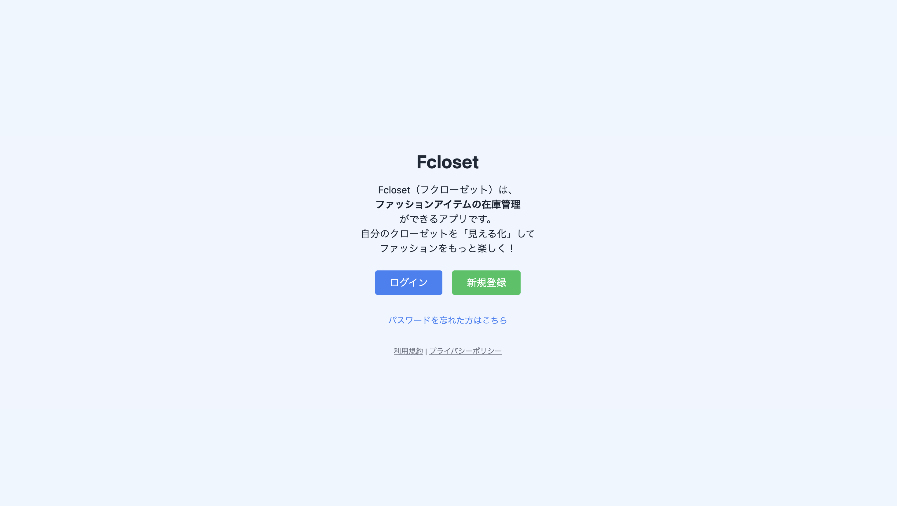
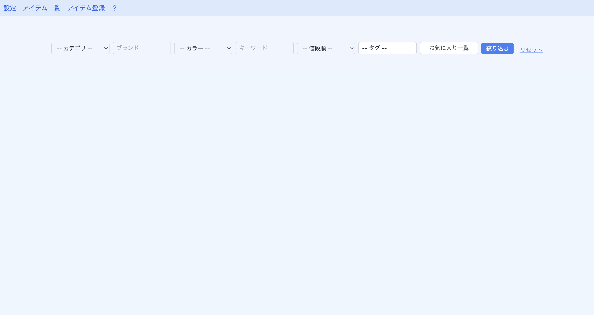
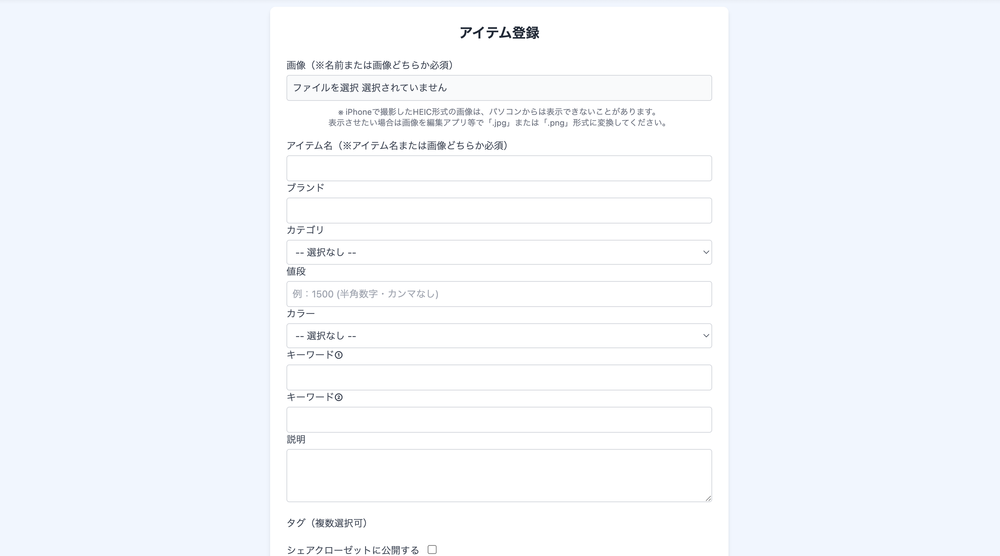
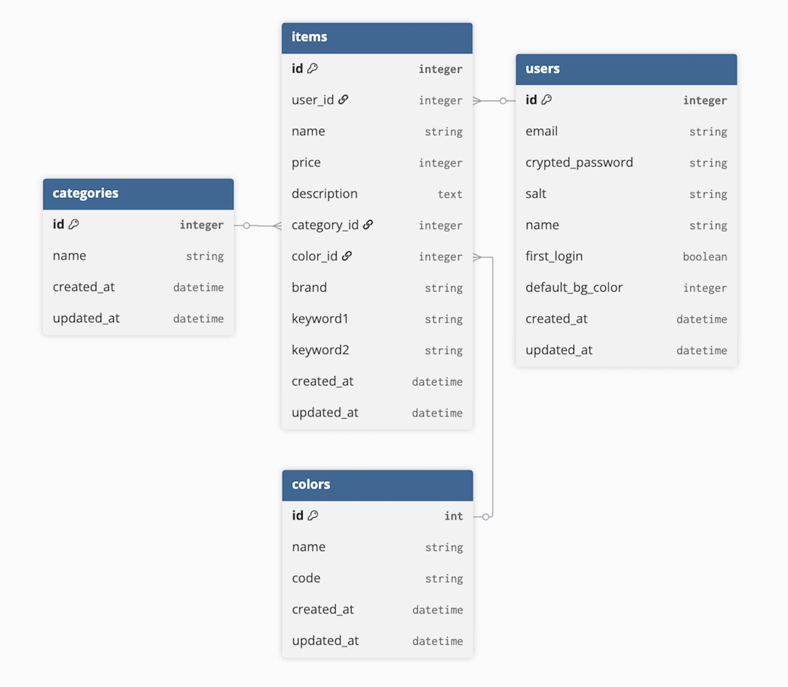

# Fcloset

洋服の在庫を可視化し、自分のクローゼットをいつでも確認できるクローゼット管理アプリです。  
持っている服を把握することで、無駄な買い物を防ぎ、コーディネートを考えやすくします。

URL  
https://fcloset-app.com

## 注意事項
現在メール送信機能はSendGridの無料トライアル終了のため、パスワードリセットメールが送信できません。  
今後Resendへの移行を予定しています。

## テストについて
RSpecは導入していますが、テスト整備は今後の課題としています。

---

# サービス概要

Fclosetは、自分の持っている洋服を登録して管理できるクローゼット管理アプリです。

ユーザーは洋服の画像を登録し、カテゴリやタグで整理することで  
自分のクローゼットを可視化できます。

これにより、

- 同じような服を買ってしまう
- 手持ちの服に合うアイテムがわからない

といった悩みを減らすことができます。

---

# 制作背景

私自身、洋服を買うことが好きで多くの服を購入してきました。  
しかし、

「こんな服持っていたっけ？」  
「この服に合うアイテムがない」

と感じることが多くありました。

過去には手持ちの服を紙にイラストで描き、  
クローゼットを可視化してコーディネートを考えていたこともあります。

その経験から、

**「いつでも自分のクローゼットを確認できるアプリがあれば便利なのではないか」**

と考え、このサービスを開発しました。

---

# 画面イメージ

## ホーム画面

## アイテム一覧

## アイテム詳細

# ER図

# UIデザイン

Figma：https://www.figma.com/design/hZvgCsDVHEITebUBROoIy5/Fcloset?node-id=0-1&t=uqSCCYbQNPT1YNis-1

---

# 想定ユーザー

主なユーザー層

- ファッションが好きな人
- 手持ちの服を整理したい人
- クローゼットを可視化したい人

特に

**10代〜30代のファッションに関心の高いユーザー**

をメインターゲットとしています。

洋服の購入頻度が高い世代のため  
このアプリの価値を感じてもらいやすいと考えました。

また、物価上昇により自由に使えるお金が限られる中で  
持っている服を把握することで無駄な出費を防ぐことにもつながります。

---

# 利用イメージ

ユーザーはアプリに洋服を登録し、自分のクローゼットを一覧で確認できます。

利用シーン

- 買い物中に手持ちの服を確認する
- コーディネートを考える
- 服装の共有をする

例えば

- 「似た服を持っていた」
- 「合わせる服がなかった」

といった失敗を減らすことができます。

また、コーディネートやアイテムを共有することで  
友人や家族と服装の相談もしやすくなります。

---

# 主な機能

### ユーザー機能

- ユーザー登録 / ログイン
- パスワードリセット

### アイテム管理

- 洋服の登録（画像・名前・カテゴリ）
- アイテム一覧表示
- アイテム詳細表示
- カテゴリ管理

### UI

- トレーディングカード風デザイン
- テーマカラー変更

### その他

- 画像登録
- クローゼット共有

---

# MVP機能

- 服の登録（画像・名前・カテゴリ・値段・色・状態）
- 一覧表示
- 詳細表示
- ログイン機能
- カテゴリ分類
- アイテムシェア機能

---

# 今後追加予定の機能

- 画像透過機能
- AIによるおすすめアイテム提案
- コーディネート保存
- アイテム / コーデのシェア機能
- タグ分類

---

# 使用技術

### Backend

- Ruby 3.x
- Ruby on Rails 7

### Frontend

- Tailwind CSS
- JavaScript

### インフラ

- Render
- PostgreSQL
- Docker

### 認証

- Devise

### 画像管理

- Active Storage

### API（予定）

- remove.bg API
- OpenAI API
